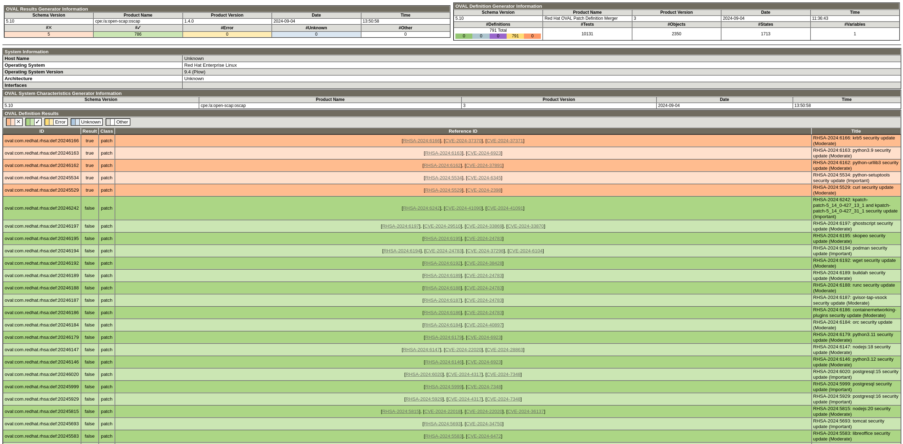

# oscap-cve-hc
This repo is to help to do  health check of image for CVE using oscap-podman 

# Manual Steps to scan image health check for CVE 
Pre-requisite:
- Install oscap-podman  
  `sudo dnf -y install openscap-utils`
- Install podman to pull image  
  `sudo dnf -y install podman`
- Download OVAL definition according the RHEL Major version from your image
```shellSession
  wget -q -O - https://www.redhat.com/security/data/oval/v2/9/rhel-9.oval.xml.bz2 | bzip2 --decompress -f > rhel-9.oval.xml
```
- Must have root access to use oscap-pomand to scan 
- Tested only with RHEL and Fedora 

## Start scan the image:
- From root user
```shellSession
oscap-podman 440906d95020 oval eval --report /home/your-user-name/Downloads/ceph6.html rhel-9.oval.xml
oscap-podman registry.redhat.io/rhceph/rhceph-6-rhel9:6-334 --report /home/ava/Downloads/ceph6.html rhel-9.oval.xml
```
# Using the shellscript run image health check for CVE
Usage: 
```shellShession
bash oscap-podman-hc.sh
------------------------------------------------------------------------------------------------------------------------
Usage: oscape-podman-hc.sh -i|--image-name  <image-id|image-name> -o|-output-html <output filename> -u|--user-name <linux username> -v|-rhel-ver <hrel9|rhel8>
Usage: oscape-podman-hc.sh [-h | --help]
Usage Ex1: oscape-podman-hc.sh -i 440906d95020 -o ceph6 -u ava -v rhel9
Usage Ex2: oscape-podman-hc.sh -i registry.redhat.io/rhceph/rhceph-6-rhel9:6-334 -o ceph6 -u ava -v rhel9
```

## Results of Oscap CVE Health Check SCAN


